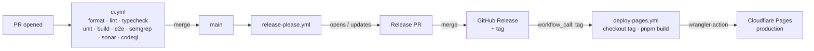

<div align="center">


# Multivert

<!-- Badges here -->
</div>

A credible, free, sharable web quiz that classifies takers across all five
"vert" types — **introvert**, **extrovert**, **ambivert**, **omnivert**, and
**otrovert** — using a multi-axis scoring model that respects each type's
defining feature. Every taker sees five independent fit percentages with a
dominant-type headline, plus links to peer-reviewed and clinical sources.

> Built with vibes, AI, and a small pile of cited research. Not a diagnosis.
> Don't put it on your résumé.

## Stack

- **SvelteKit** (Svelte 5) + **Tailwind CSS**
- **`@sveltejs/adapter-cloudflare`** — deploys to **Cloudflare Pages**
- **TypeScript** (strict)
- **Vitest** + **Playwright** + **Lighthouse CI**

## Features

- **Five "vert" types, not a bucket.** Introvert, extrovert, ambivert, omnivert, otrovert — each scored on its own 0–100% scale. The bars don't sum to 100. An introverted otrovert can legitimately score high on both.
- **Continuous sliders, not radio buttons.** Range -1.0 → 1.0 with a "deliberately neutral" zero. The thumb stays hidden until you move it, so "unset" is visibly different from "I picked the middle."
- **Multi-axis scoring with reverse-scored items.** 35 questions across four dimensions. 31% are reverse-scored to keep the otherness axis honest. All items rewritten in the project's voice — meaning preserved, IPIP boilerplate not.
- **Deterministic engine.** Pure TypeScript, fully client-side, unit-tested. The locked weight matrix lives in [`docs/PRD.md`](./docs/PRD.md) and changes only via PRD revision. AI is permitted for result-paragraph tone, never for score computation.
- **Cited sources, no diagnosis.** IPIP, Adam Grant, Cleveland Clinic, Kaminski. Surfaced on the results page so you can argue with them.
- **No tracking, no persistence.** Slider answers never leave the browser. No analytics pixels, no third-party trackers, no cookies you didn't ask for.
- **Mobile-first, keyboard-navigable.** Big touch targets, arrow keys nudge the slider, Enter advances.

## Architecture

Single-scroll SvelteKit app, statically rendered onto Cloudflare Pages. The
scoring engine is deterministic and lives entirely client-side — no backend,
no database, no telemetry. The release pipeline is the only moving part worth
diagramming.



`main` only deploys when a Release Please PR merges. Direct pushes don't ship —
they just queue commits for the next release.

## Deploy & CI

Three workflows under `.github/workflows/`:

| Workflow             | Trigger                                          | Purpose                                                                                                                 |
| -------------------- | ------------------------------------------------ | ----------------------------------------------------------------------------------------------------------------------- |
| `ci.yml`             | push to `main`, PR, manual                       | Quality gate: format, lint, typecheck, unit, build, Playwright, secret scan, Sonar                                      |
| `release-please.yml` | push to `main`, manual                           | Cuts release PRs from Conventional Commits; chains `deploy-pages.yml` on `release_created`                              |
| `deploy-pages.yml`   | `workflow_call(tag)` or `workflow_dispatch(tag)` | Reusable: checks out the tag, builds, deploys to Cloudflare Pages via `cloudflare/wrangler-action`, smoke-tests the URL |

Cloudflare credentials (`CLOUDFLARE_API_TOKEN`, `CLOUDFLARE_ACCOUNT_ID`) are
scoped to the `deploy` GitHub environment, not the repo. Lighthouse runs locally
via lefthook pre-push, never in CI — runner variance makes the 100/100/100/100
floor too noisy on shared infra.

Need a one-off prod deploy from a specific tag? `gh workflow run deploy-pages.yml -f tag=v1.2.3`.

## Project structure

```
.
├── src/
│   ├── routes/              # SvelteKit pages — single-scroll quiz + results
│   ├── lib/
│   │   ├── scoring.ts       # deterministic per-archetype fit calculation (do not touch without PRD)
│   │   ├── archetypes.ts    # ideal vectors + weight matrix per type
│   │   ├── descriptions.ts  # result-paragraph copy
│   │   ├── questions.ts     # 35-item question bank with reverse-score flags
│   │   ├── components/      # Svelte 5 components (sliders, chapter intros, result bars)
│   │   └── state/           # rune-based quiz state
│   ├── app.css              # Tailwind v4 entry (@import 'tailwindcss')
│   ├── app.html             # document shell
│   └── app.d.ts             # SvelteKit ambient types
├── e2e/                     # Playwright specs — smoke + flow
├── docs/
│   ├── PRD.md               # locked scoring model + weight matrices
│   └── voice.md             # tone reference for result copy
├── static/                  # public assets
├── .github/workflows/       # ci.yml, release-please.yml, deploy-pages.yml, codeql.yml
├── AGENTS.md                # contributor + AI-agent contract
├── Makefile                 # canonical command surface
├── svelte.config.js         # adapter-cloudflare config
├── vite.config.ts           # Tailwind v4 plugin + dev server
└── release-please-config.json
```

## Getting started

```sh
make install   # install dependencies
make dev       # start the dev server
make test      # run unit + integration tests
make e2e       # run Playwright E2E
make build     # production build
```

See the [`Makefile`](./Makefile) for the full target list.

## Documentation

- [`docs/PRD.md`](./docs/PRD.md) — product requirements, scoring model, and locked weight matrices.
- [`AGENTS.md`](./AGENTS.md) — repository conventions for AI agents and contributors.

## Acknowledgements

The scoring model leans on actual research, not vibes-only:

- [IPIP-BFFM Big Five Test (openpsychometrics)](https://openpsychometrics.org/tests/IPIP-BFFM/) — extraversion construct baseline.
- [Adam Grant — Rethinking the Extraverted Sales Ideal (Wharton, 2013)](https://faculty.wharton.upenn.edu/wp-content/uploads/2013/06/Grant_PsychScience2013.pdf) — empirical case for ambiversion as a distinct, peak-performing third pole.
- [Cleveland Clinic — Omnivert vs Ambivert](https://health.clevelandclinic.org/omnivert-vs-ambivert) — clean lay-clinical framing for the swing axis.
- [Cleveland Clinic — Otroverts: An Emerging Personality Type](https://health.clevelandclinic.org/otrovert) and [Wikipedia](https://en.wikipedia.org/wiki/Otrovert) — otherness construct background.
- [Dr. Rami Kaminski via LADbible](https://www.ladbible.com/community/personality-type-otrovert-explained-dr-rami-kaminski-378511-20250912) and the Otherness Institute's documented otrovert traits — source for the five otherness facets the quiz covers.

Items are clinical-source, not clinically validated. The disclaimer is on the results page for a reason.

## License

[Polyform Shield 1.0.0](./LICENSE) — Copyright © 2026 Ashley Childress.

Personal, professional, and commercial _use_ is permitted; _monetization_ (sale,
paid SaaS, rebranded resale) requires prior written permission.

## Author

**Ashley Childress** — Senior Software Engineer @ The Home Depot. Builds odd, opinionated tools and writes about what AI is actually good for in production.

- GitHub: [@anchildress1](https://github.com/anchildress1)
- Site: [anchildress1.dev](https://anchildress1.dev)

This quiz is a portfolio piece, not a product. If it broke, [open an issue](https://github.com/anchildress1/multivert/issues). If you want to talk about the architecture, the GHA wiring, or why the otherness axis is unipolar, reach out — those are the interesting parts.
