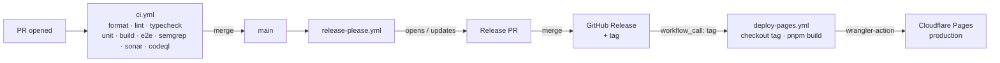

<div align="center">


# Multivert Quiz

<!-- Badges here -->
</div>

A credible, free, sharable web quiz that classifies takers across all five
"vert" types — **introvert**, **extrovert**, **ambivert**, **omnivert**, and
**otrovert** — using a multi-axis scoring model that respects each type's
defining feature. Every taker sees five independent fit percentages with a
dominant-type headline, plus links to peer-reviewed and clinical sources.

> Built with vibes, AI, and a small pile of cited research. Not a diagnosis.
> Don't put it on your résumé.

## Stack

- **SvelteKit** (Svelte 5) + **Tailwind CSS**
- **`@sveltejs/adapter-cloudflare`** — deploys to **Cloudflare Pages**
- **TypeScript** (strict)
- **Vitest** + **Playwright** + **Lighthouse CI**

## Architecture

Single-scroll SvelteKit app, statically rendered onto Cloudflare Pages. The
scoring engine is deterministic and lives entirely client-side — no backend,
no database, no telemetry. The release pipeline is the only moving part worth
diagramming.



`main` only deploys when a Release Please PR merges. Direct pushes don't ship —
they just queue commits for the next release.

## Deploy & CI

Three workflows under `.github/workflows/`:

| Workflow             | Trigger                                          | Purpose                                                                                                                 |
| -------------------- | ------------------------------------------------ | ----------------------------------------------------------------------------------------------------------------------- |
| `ci.yml`             | push to `main`, PR, manual                       | Quality gate: format, lint, typecheck, unit, build, Playwright, secret scan, Sonar                                      |
| `release-please.yml` | push to `main`, manual                           | Cuts release PRs from Conventional Commits; chains `deploy-pages.yml` on `release_created`                              |
| `deploy-pages.yml`   | `workflow_call(tag)` or `workflow_dispatch(tag)` | Reusable: checks out the tag, builds, deploys to Cloudflare Pages via `cloudflare/wrangler-action`, smoke-tests the URL |

Cloudflare credentials (`CLOUDFLARE_API_TOKEN`, `CLOUDFLARE_ACCOUNT_ID`) are
scoped to the `deploy` GitHub environment, not the repo. Lighthouse runs locally
via lefthook pre-push, never in CI — runner variance makes the 100/100/100/100
floor too noisy on shared infra.

Need a one-off prod deploy from a specific tag? `gh workflow run deploy-pages.yml -f tag=v1.2.3`.

## Getting started

```sh
make install   # install dependencies
make dev       # start the dev server
make test      # run unit + integration tests
make e2e       # run Playwright E2E
make build     # production build
```

See the [`Makefile`](./Makefile) for the full target list.

## Documentation

- [`docs/PRD.md`](./docs/PRD.md) — product requirements, scoring model, and locked weight matrices.
- [`AGENTS.md`](./AGENTS.md) — repository conventions for AI agents and contributors.

## License

[Polyform Shield 1.0.0](./LICENSE) — Copyright © 2026 Ashley Childress.

Personal, professional, and commercial _use_ is permitted; _monetization_ (sale,
paid SaaS, rebranded resale) requires prior written permission.
